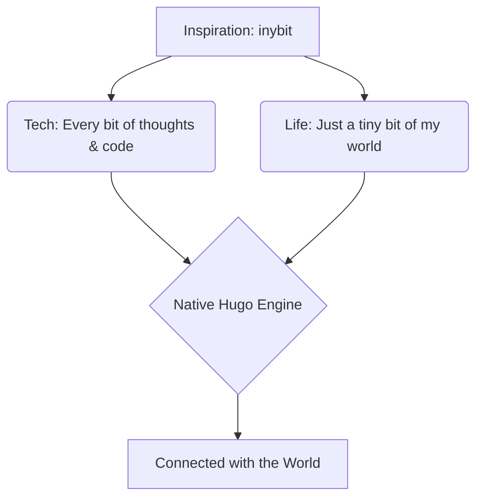

## What is inybit?

**inybit** (pronounced: `/ˈɪni-bɪt/`), a disyllabic name with the brisk cadence of **bit** at the end. It rolls off the tongue naturally and leaves a lasting impression.

A subtle pun: it sounds just like **"Tiny bit"**, carrying a modest, minimalist, and poetic nuance — *recording every tiny bit of thoughts and life*.


- **Tech direction**: `Every bit of thoughts & code.`
- **Life direction**: `Just a tiny bit of my world.`


---

## Core Features

Inspired by modern benchmarks like Nextra and Hextra, crafted from scratch with native Hugo:


  
  
  
  
  
  
  
  
  
  
  
  
  
  
  
  


---

## Code Block & Syntax Highlighting

High-contrast syntax highlighting in both light and dark modes, with language badge and one-click copy feedback.

```go
package main

import (
	"fmt"
	"time"
)

type InybitBlog struct {
	Name      string
	CreatedAt time.Time
	Slogan    string
}

func main() {
	blog := InybitBlog{
		Name:      "inybit",
		CreatedAt: time.Now(),
		Slogan:    "Every bit of thoughts & code.",
	}
	fmt.Printf("Welcome to %s: %s\n", blog.Name, blog.Slogan)
}
```

---

## LaTeX Math

$$
\int_{-\infty}^{\infty} e^{-x^2} dx = \sqrt{\pi}
$$

---

## Diagrams (Mermaid)



Every tiny bit deserves to be recorded. ✨