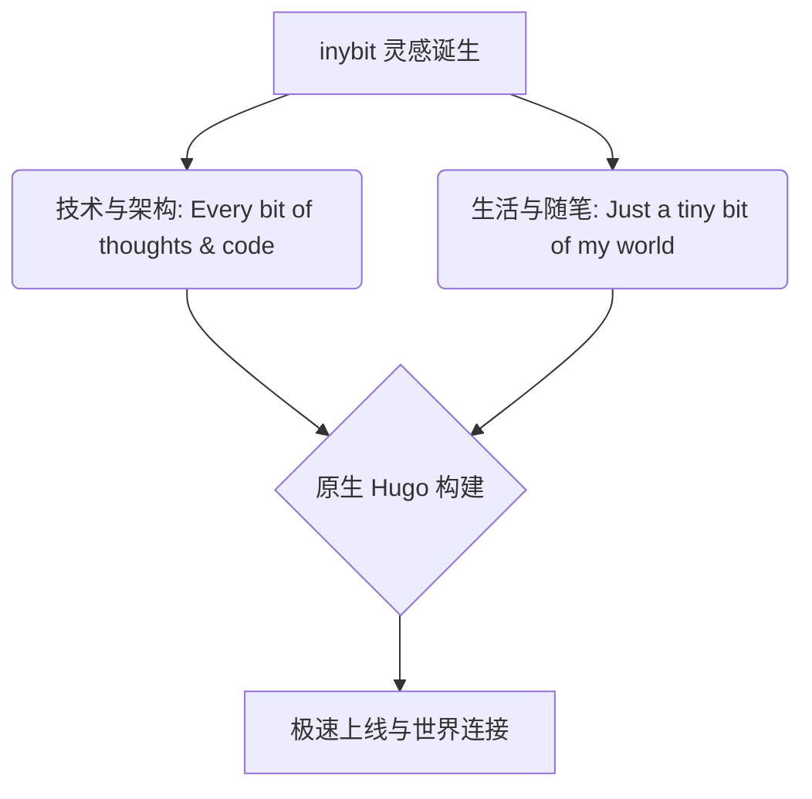

## inybit 是什么？

**inybit**（发音：`/ˈɪni-bɪt/`），双音节，尾音带有 **bit** 的轻快感，口播和朗读时非常顺口，让人印象深刻。

谐音双关：听起来很像 **"Tiny bit"**（一点点 / 微小），带有某种谦逊、极简、精细的诗意感——*记录生活与思考的一点一滴*。


- **技术向**：`Every bit of thoughts & code.`（每一比特的思考与代码）
- **生活向**：`Just a tiny bit of my world.`（我世界里的一点一滴）


---

## 核心特性一览

参考现代文档与博客标杆设计（如 Nextra 与 Hextra），从零量身打造纯原生 Hugo 体验：


  
  
  
  
  
  
  
  
  
  
  
  
  
  
  
  


---

## 代码块高亮与排版演示

彻底解决了以往“黑底黑字”的对比度问题。在浅色与深色模式下，代码块均具备极高对比度的配色方案，并自带语言徽标与一键复制功能。

### Go 语言示例

```go
package main

import (
	"fmt"
	"time"
)

// InybitBlog 代表个人博客实体
type InybitBlog struct {
	Name      string
	CreatedAt time.Time
	Slogan    string
}

func main() {
	blog := InybitBlog{
		Name:      "inybit",
		CreatedAt: time.Now(),
		Slogan:    "Every bit of thoughts & code.",
	}
	fmt.Printf("欢迎来到 %s: %s\n", blog.Name, blog.Slogan)
}
```

### Python 语言示例

```python
def fibonacci(n: int) -> list[int]:
    """生成斐波那契数列"""
    a, b = 0, 1
    result = []
    for _ in range(n):
        result.append(a)
        a, b = b, a + b
    return result

if __name__ == "__main__":
    print("Tiny bit of math:", fibonacci(8))
```

### Shell 终端示例

```bash
# 构建并启动 Hugo 本地实时预览服务
hugo server -D --disableFastRender
```

---

## LaTeX 数学公式

主题原生支持行内公式与块级公式排版，渲染清晰美观。

- **行内公式**：质能方程 $E = mc^2$，以及欧拉恒等式 $e^{i\pi} + 1 = 0$。
- **块级公式**：著名的高斯积分与傅里叶变换：

$$
\int_{-\infty}^{\infty} e^{-x^2} dx = \sqrt{\pi}
$$

$$
\hat{f}(\xi) = \int_{-\infty}^{\infty} f(x) e^{-2\pi i x \xi} dx
$$

---

## Mermaid 图表渲染

直接在 Markdown 中书写 ````mermaid` 代码块，即可自动呈现响应式矢量图表：



---

## 精选短代码组件

### 1. Callout 提示框（全新 5 色刷新）


A callout is a short piece of text intended to attract attention. 适合展示操作技巧、核心思路或创意推荐。



A callout is a short piece of text intended to attract attention. 适合展示通用的背景说明、文档指引或版本信息。



A callout is a short piece of text intended to attract attention. 提醒读者注意潜在的配置冲突或注意事项。



A callout is a short piece of text intended to attract attention. 标明高风险、敏感权限或破坏性操作。



A callout is a short piece of text intended to attract attention. 用于突出关键约束、核心规则或里程碑定义。


### 2. Tabs 选项卡切换


  
```bash
pnpm install
pnpm build
```
  
  
```bash
npm install
npm run build
```
  
  
```bash
yarn install
yarn build
```
  


### 3. Steps 步骤指引


### 步骤一：创建 Hugo 站点
在终端执行基础命令快速生成站点脚手架。

### 步骤二：接入 inybit 原创主题
配置 `theme = 'inybit'`，启用无拘无束的轻量原生体验。

### 步骤三：开始沉淀每一比特的思考
用熟悉的 Markdown 记录你的技术世界与生活点滴。


### 4. FileTree 目录树展示


inybit/
├── content/
│   ├── posts/
│   │   └── hello-world.md
│   └── about/
├── themes/
│   └── inybit/
│       ├── layouts/
│       └── static/
└── hugo.toml


### 5. Asciinema 终端录屏

通过全新的 Asciinema 短代码，开箱即用嵌入交互式终端录屏回放：




---

## 常用 Markdown 元素支持

### 表格

| 特性 | 状态 | 技术栈 |
| :--- | :---: | :--- |
| **现代设计美学** | ✅ | 纯原生 CSS 变量 + 毛玻璃顶栏 |
| **响应式与暗色模式** | ✅ | 手机/平板/桌面全适配 + 零闪烁 |
| **离线全文搜索** | ✅ | FlexSearch (无需外接服务) |
| **LaTeX 公式** | ✅ | KaTeX 原生 Passthrough |
| **图表支持** | ✅ | Mermaid.js 渲染钩子 |
| **SEO 与可访问性** | ✅ | Open Graph / JSON-LD / A11y 友好 |

### 引用与列表

> “写代码就像写文章，最重要的是让读者（包括未来的自己）能看懂。”

- [x] 搭建 Hugo 站点
- [x] 从零构建 inybit 主题
- [x] 修复代码块高亮与黑底黑字对比度
- [x] 集成离线全文搜索与丰富短代码
- [ ] 记录更多精彩内容

每一个 tiny bit，都值得被认真记录。✨